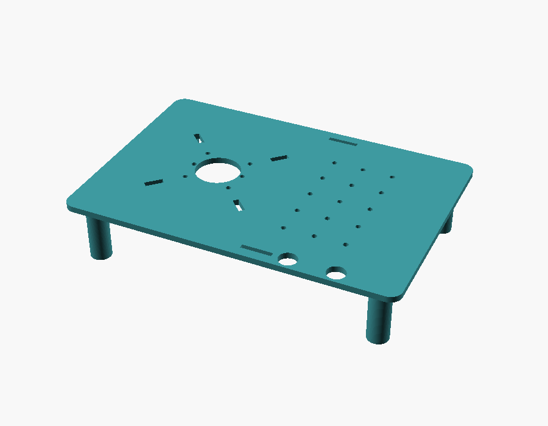
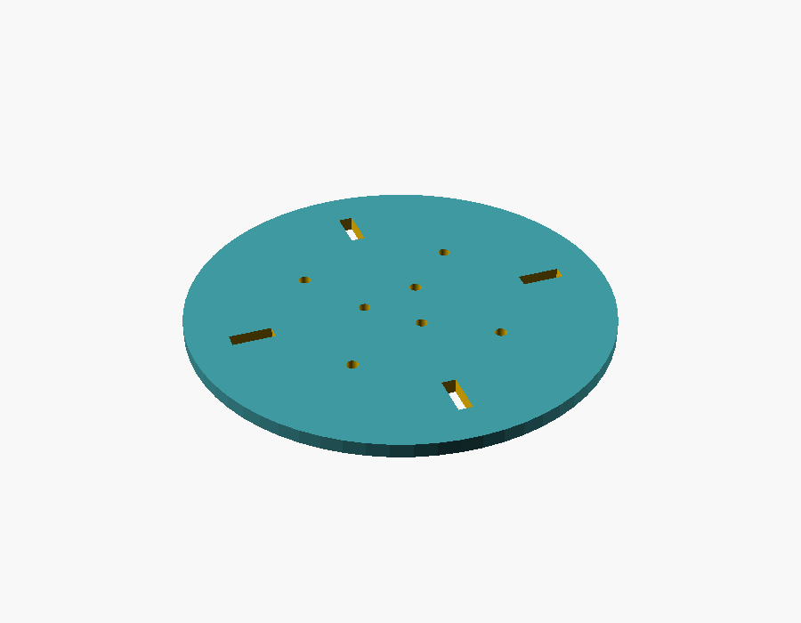
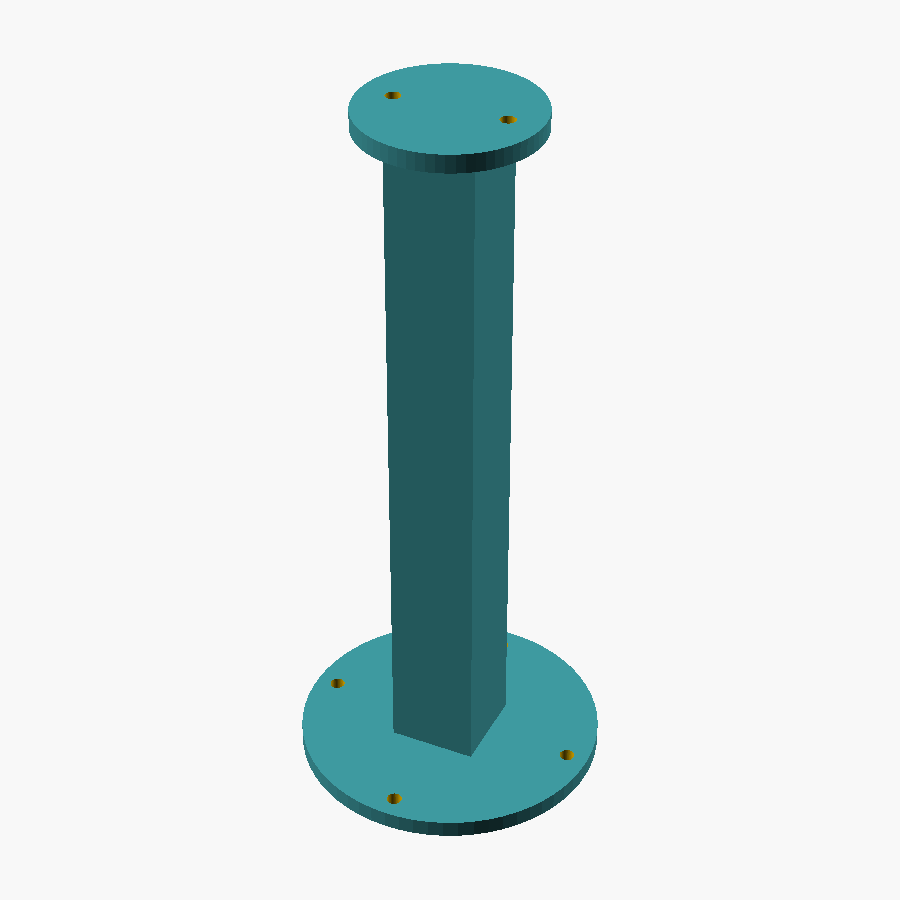
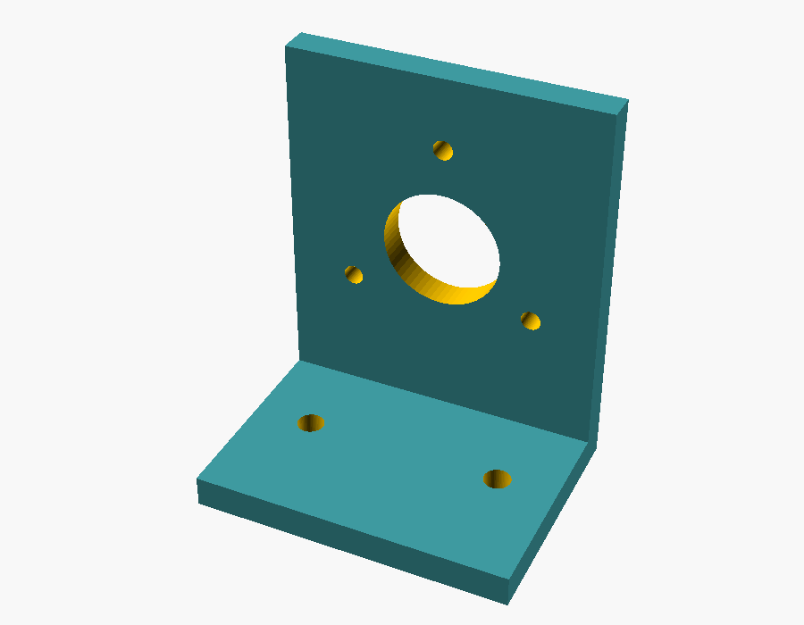
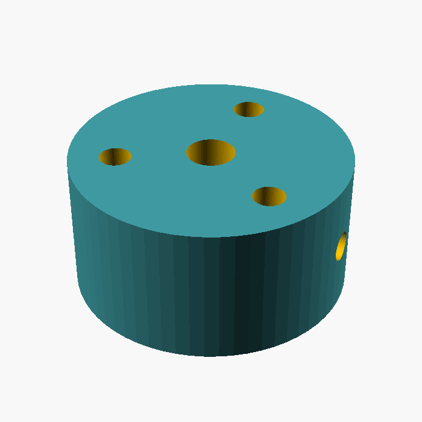
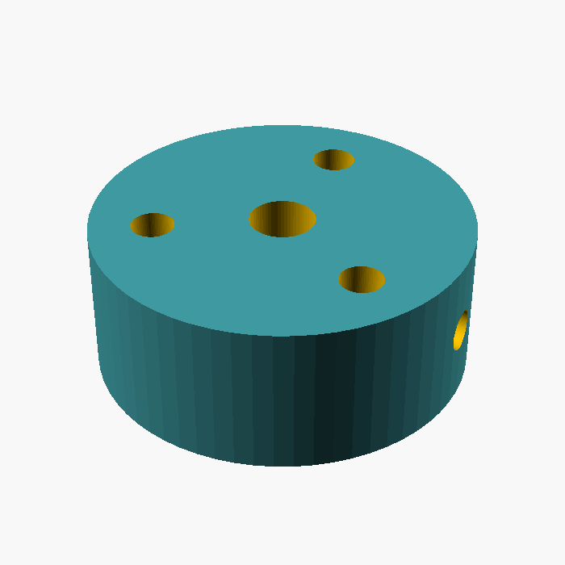

# 3D-Printed Parts

Six parts, parametric OpenSCAD source in [`models/`](models/) (open with the
free [OpenSCAD](https://openscad.org/) app to tweak dimensions or export
STL). Every file was rendered and checked in this repo's CI-equivalent
process (`openscad --render`, exported to STL, visually inspected for
overlapping/colliding holes) — see the PNG preview next to each part below.
That verification caught and fixed two real layout bugs during design (a
mounting hole placed exactly on the plate edge, and a foot standoff whose
footprint silently overlapped a grid hole); the numbers below are the
corrected, checked versions, not a first draft.

**What's *not* verified**: the exact hole spacing on the LD06/LD19's own
mounting face and on your specific lazy-susan bearing. Those two figures are
common/representative values from general knowledge, not measured off a
datasheet or a part in hand — see the callouts below. Everything else
(bolt patterns between our own printed parts, standard NEMA17 dimensions,
M3 clearances) is either self-consistent by construction or a fixed
mechanical standard, so it's solid.

## Design approach

Rather than adapting PiLiDAR-Hardware's exact CAD files (their planetary
gearbox + Pi4-sized enclosure geometry doesn't bolt up to this build's
different motor/bearing choices — see [BOM.md](BOM.md) for why), these six
parts are a from-scratch, simpler mechanical layout sized around this
build's parts:

- **No gearbox.** Direct-drive NEMA17 (or 28BYJ-48) instead of PiLiDAR's
  3D-printed planetary reduction — see [ARCHITECTURE.md § 4](ARCHITECTURE.md#4-motion-system)
  for the resolution math showing this doesn't cost any azimuth precision.
- **A hardware lazy-susan bearing carries the load**, not the motor shaft
  or a printed thrust surface — cheap, and it's the difference between a
  turntable that's rigid for years and one that wears loose in a month.
- **The battery is strapped on, not enclosed.** Recommended and Budget tiers
  use different power-bank sizes (BOM.md), so a tightly-fitted battery
  compartment would only fit one of them. A flat strap area (two slots,
  any hook-and-loop strap or bungee) fits either, and any battery you
  swap in later.
- **A generic M3 mounting grid** for the Pi/driver board/boost converter,
  rather than component-specific bosses. Their exact footprints depend on
  which exact boards you bought; a 20mm grid of clearance holes lets you
  zip-tie or M3-standoff whatever you actually have, instead of hoping
  your parts match a hole pattern sized for parts I don't have in hand.

## Parts

### 1. Base plate — `models/base_plate.scad`

The stationary bottom of the scanner: bearing's fixed leaf, motor
(hanging underneath, shaft through the center bore), electronics, buttons,
battery straps, tripod mount.

| Dimension | Value | Notes |
|---|---|---|
| Overall | 220 × 150 × 4 mm | rounded corners, r=8mm |
| Center bore | ⌀30 mm | motor shaft + wiring pass-through |
| Bearing mounting | 4× slots, 4×12mm, on ⌀85mm bolt circle at 45/135/225/315° | **slots, not holes** — tolerant of your bearing's exact hole spacing; transfer-mark from the real part, see [BUILD.md](BUILD.md) |
| NEMA17 motor holes | 4× ⌀3.4mm (M3 clearance), 31.04×31.04mm square, centered on the bore | standard NEMA17 pattern |
| 28BYJ-48 motor holes | 2× ⌀3.4mm, 35mm apart, centered on the bore | both motor patterns are present simultaneously — use whichever matches your BOM tier |
| Feet | 4× ⌀14×40mm posts, corners | 40mm clears the NEMA17 body hanging underneath (see ARCHITECTURE.md) |
| Tripod mount | ⌀20mm boss, ⌀9.6mm pilot hole, underside | sized for a standard 1/4"-20 heat-set insert — **verify against the insert you buy**, they vary a mm or so by brand |
| Electronics grid | 3×5 array of ⌀3.4mm holes, 20mm pitch | generic mount for Pi/driver/boost — zip-tie or M3 standoff whatever you have |
| Button holes | 2× ⌀12mm | scan-trigger + power |
| Battery strap slots | 2× 20×3mm slots | route a hook-and-loop strap or bungee through these to hold the power bank |

Print flat, no supports, PETG or PLA, 3-4 walls, 25% infill.

### 2. Rotating platter — `models/platter.scad`

The turntable top: bearing's rotating leaf, motor hub, mast all bolt here.

| Dimension | Value | Notes |
|---|---|---|
| Overall | ⌀120 × 4 mm disc | |
| Bearing mounting | same 4×12mm slots on ⌀85mm bolt circle as the base plate, 45/135/225/315° | **must match the base plate** — same bearing |
| Motor hub bolts | 3× ⌀3.4mm on ⌀20mm bolt circle, 90/210/330° | must match `motor_hub_*.scad` |
| Mast bolts | 4× ⌀3.4mm on ⌀60mm bolt circle, 0/90/180/270° | offset in both radius *and* angle from the bearing slots so nothing overlaps — must match `mast.scad` |

Print flat, no supports, PETG or PLA, 4+ walls, 30-40% infill (denser than
the base plate — this one carries the mast + sensor).

### 3. Mast — `models/mast.scad`

| Dimension | Value | Notes |
|---|---|---|
| Post | 20×20mm square, 160mm tall | solid, not hollow — route the LiDAR's 4 wires externally, zip-tied along the post (see BUILD.md) |
| Bottom flange | ⌀70×4mm, 4× ⌀3.4mm holes on ⌀60mm bolt circle | bolts to the platter |
| Top flange | ⌀40×4mm, 2× ⌀3.4mm holes, 25mm apart | bolts to `lidar_mount.scad` |

160mm of height is enough to clear the base electronics for most of the
sensor's vertical field of view — some blind cone directly underneath is
unavoidable with this scan geometry regardless of mast height (see
[ARCHITECTURE.md § 8](ARCHITECTURE.md#8-known-limitations-inherent-to-this-scan-geometry-not-this-budget)).

Print standing up, no supports needed. PETG recommended over PLA — PLA
can slowly creep/lean under the sensor's small offset load, which would
show up as scan drift over time.

### 4. LiDAR mount bracket — `models/lidar_mount.scad`

L-bracket holding the LD06/LD19 with its spin axis **horizontal** (mounting
face vertical) — see [ARCHITECTURE.md § 1](ARCHITECTURE.md#1-system-overview)
for why the sensor has to sit sideways, not flat like in a robot vacuum.

| Dimension | Value | Notes |
|---|---|---|
| Foot | 40×30×4mm, 2× ⌀3.4mm holes, 25mm apart | matches `mast.scad`'s top flange |
| Wall | 40mm wide × 45mm tall × 4mm thick, rising from the foot's back edge | |
| Sensor bolt circle | 3× ⌀2.5mm on **⌀27mm** bolt circle, 90/210/330° | **approximate — verify against your actual LD06/LD19 before printing.** This figure is a commonly-cited value, not measured from a datasheet in hand. If it's off, re-measure your unit's 3 mounting holes and edit `sensor_bolt_circle_d` in the .scad file before slicing. |
| Cable clearance | ⌀15mm, centered on the bolt circle | |

Print with the foot face-down, no supports (the wall is a straight
vertical extrusion, self-supporting).

**The sensor's physical offset from the mast's rotation axis is exactly
the `Y_OFFSET`/`Z_OFFSET` your software calibration needs** (see
`src/config.json` and [ARCHITECTURE.md](ARCHITECTURE.md)) — measure it on
the assembled bracket and start your calibration from that number rather
than guessing.

### 5. NEMA17 motor hub — `models/motor_hub_nema17.scad` (Recommended tier)

Clamps onto the NEMA17's 5mm D-shaft, bolts to the platter's underside.
This part carries all drive torque — print it solid.

| Dimension | Value | Notes |
|---|---|---|
| Hub | ⌀30 × 15mm | (first draft was ⌀25mm — left only ~0.8mm wall around the bolt holes; bumped to 30mm for a real 3mm+ wall) |
| Shaft bore | ⌀5.2mm | NEMA17 shaft is 5mm nominal, +0.2mm print-fit allowance |
| Set screw | M3 radial, thread-formed into the print (or tap / threaded insert) | clamps onto the shaft's D-flat |
| Bolt pattern | 3× ⌀3.4mm on ⌀20mm bolt circle, 90/210/330° | must match `platter.scad` |

PETG strongly recommended for this part specifically — it's the highest
stress-concentration point in the whole mechanism.

### 6. 28BYJ-48 motor hub — `models/motor_hub_uln2003.scad` (Budget tier)

Same bolt pattern as the NEMA17 hub, shorter (12mm) to match the
28BYJ-48's shorter output shaft.

**Check your specific kit before printing**: many 28BYJ-48 motors ship
with a small plastic coupler/gear already pressed onto the output shaft.
Either remove it and bore this hub for the bare ~5mm D-shaft (the default
here), or measure that coupler's outer diameter and change `shaft_bore_d`
to clamp onto it instead.

## Print settings summary

| Part | Material | Infill | Supports |
|---|---|---|---|
| Base plate | PETG or PLA | 25% | No |
| Platter | PETG or PLA | 30-40% | No |
| Mast | PETG (PLA can creep) | 30% | No |
| LiDAR mount | PETG or PLA | 30% | No |
| Motor hubs (either) | PETG | 50%+ or solid | No |

All six parts print without supports as designed (flat plates, vertical
extrusions, no overhangs past 45°). None require a print bed larger than
220×150mm.
